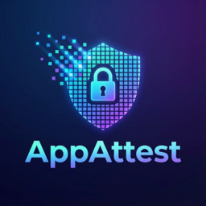

<p align="center">
  
</p>

<p align="center">
  <a href="https://www.npmjs.com/package/app-attest-server">
    
  </a>
  <a href="https://github.com/figamore/app-attest-server/blob/main/LICENSE">
    
  </a>
</p>

# app-attest-server: iOS Device Attestation Validation for Node.js

A lightweight and secure npm package for server-side validation of Apple App Attest artifacts and assertions. Provides robust protection against replay attacks, request forgery, and unauthorized API access by ensuring requests come from genuine, attested iOS devices.

**Works seamlessly with [AppAttestKit](https://github.com/figamore/AppAttestKit), a Swift package that handles the iOS client-side implementation.**

## Table of Contents

- [Requirements](#requirements)
- [Features](#features)
- [Installation](#installation)
- [Usage](#usage)
  - [Basic Server Setup](#basic-server-setup)
- [Configuration](#configuration)
  - [Required Configuration](#required-configuration)
  - [Environment Variables](#environment-variables)
  - [Database Configuration](#database-configuration)
- [API Reference](#api-reference)
  - [Core Functions](#core-functions)
  - [Required Endpoints](#required-endpoints)
- [Examples](#examples)
- [Important Notes](#important-notes)
  - [Development vs Production Modes](#development-vs-production-modes)
  - [General Requirements](#general-requirements)
- [iOS Client Package](#ios-client-package)
- [Finding Your Team ID](#finding-your-team-id)
  - [If You Have a Paid Apple Developer Account](#if-you-have-a-paid-apple-developer-account)
  - [If You Don't Have a Paid Account (Testing Only)](#if-you-dont-have-a-paid-account-testing-only)
- [License](#license)

## Requirements

- Node.js 16.0.0 or higher
- Apple Developer Account with Team ID
- iOS app using App Attest (iOS 14.0+)

## Features

- **Secure Attestation**: Validates App Attest requests to ensure requests come from genuine iOS devices
- **Easy Integration**: Straightforward API for verifying App Attest requests on the server-side
- **Automatic Storage**: Uses SQLite to automatically store and manage attestations

## Installation

```bash
npm install app-attest-server
```

The package automatically sets up the necessary SQLite database and tables to store and manage attestations.

## Usage

### Basic Server Setup

```javascript
const express = require('express');
const AppAttest = require('app-attest-server');

// Configuration - use environment variables in production
const teamId = process.env.APPLE_TEAM_ID || 'YOUR_10_CHAR_TEAM_ID';
const bundleIdentifier = process.env.BUNDLE_IDENTIFIER || 'com.example.your-app';
const isDevelopment = process.env.NODE_ENV !== 'production';

const app = express();
app.use(express.json());

// Generate challenge nonce for attestation
app.get('/api/nonce', async (req, res) => {
  const randomNonce = await AppAttest.getNonce(req);
  if (randomNonce?.error) {
    return res.status(400).json({ error: 'Failed to generate nonce' });
  }
  return res.status(200).json({ nonce: randomNonce });
});

// Register device attestation
app.post('/api/registerattestation', async (req, res) => {
  const result = await AppAttest.registerAttestation(req, teamId, bundleIdentifier, isDevelopment);
  if (result?.error) {
    return res.status(400).json({ error: 'Attestation registration failed' });
  }
  console.log('Successfully registered attestation');
  return res.status(200).json({ success: true });
});

// Protected route with assertion validation
app.post('/api/protectedroute', async (req, res) => {
  const assertionResult = await AppAttest.validateAssertion(req, teamId, bundleIdentifier);

  if (assertionResult?.error) {
    // Important: Return 422 for 'nokey' to trigger client re-attestation
    if (assertionResult.error === 'nokey') {
      return res.status(422).json({ error: 'Device not registered. Please re-attest.' });
    }
    return res.status(400).json({ error: 'Assertion validation failed' });
  }

  console.log(`Assertion validated. Count: ${assertionResult}`);
  return res.status(200).json({ assertionsCount: assertionResult });
});

app.listen(3001, () => {
  console.log('AppAttestKit server running on port 3001');
});
```

## Configuration

### Required Configuration

- **Team ID**: Your 10-character Apple Developer Team ID (see [Finding Your Team ID](#finding-your-team-id))
- **Bundle Identifier**: Your app's bundle identifier (e.g., com.example.app)
- **DEV_MODE**: Set to `true` for development builds, `false` for production

### Environment Variables

```bash
# Required
APPLE_TEAM_ID=YOUR_10_CHAR_TEAM_ID
BUNDLE_IDENTIFIER=com.example.your-app

# Optional
NODE_ENV=production
ATTESTATION_DB_PATH=./attestations.db
PORT=3001
```

### Database Configuration

- **Database Path**: Configurable via `ATTESTATION_DB_PATH` environment variable
- **Auto-initialization**: SQLite database and tables created automatically
- **Storage**: Device attestation keys, counters, and timestamps
- **No manual management**: Package handles all database operations

## API Reference

### Core Functions

#### `getNonce(req)`
Generates a challenge nonce for attestation.

#### `registerAttestation(req, teamId, bundleIdentifier, DEV_MODE)`
Registers a device attestation and stores the public key.

#### `validateAssertion(req, teamId, bundleIdentifier)`
Validates assertion signatures from registered devices.

#### `validateAttestation(attestationNonce, keyId, rawAttestObject, teamId, bundleIdentifier, DEV_MODE)`
Validates a new device attestation during registration.

### Required Endpoints

Your server needs these three endpoints for App Attest to work:

#### 1. **GET `/api/nonce`**
- Returns a challenge (nonce) to the client for attestation
- Uses `AppAttest.getNonce(req)` to generate a secure nonce
- Requires `device-id` header from client
- Returns 400 if nonce generation fails

#### 2. **POST `/api/registerattestation`** 
- Accepts attestation registration from the iOS client
- Expects request body with `keyId` and `attestationObject`
- Uses `AppAttest.registerAttestation(req, teamId, bundleIdentifier, DEV_MODE)`
- Returns 400 for validation errors, 200 for success

#### 3. **POST `/api/protectedroute`** (or your protected routes)
- Validates assertions on protected routes
- Uses `AppAttest.validateAssertion(req, teamId, bundleIdentifier)`
- **Important**: Returns 422 when `error === 'nokey'` to trigger client re-attestation
- Returns 400 for other validation errors, 200 for success

> **Note**: You can rename these endpoints to match your API design, but the functionality must remain the same.


## Examples

Complete working examples are available in the `examples/` directory:
- **Server**: Express.js server with all required endpoints

## Important Notes

### Development vs Production Modes

App Attest operates in two distinct environments:

- **Development Mode**: Set `DEV_MODE = true` for development builds and testing
  - Uses AAGUID value "appattestdevelop" 
  - Attestations don't affect app risk metrics
  - Used for simulator testing and development builds

- **Production Mode**: Set `DEV_MODE = false` for App Store builds
  - Uses AAGUID value "appattest" followed by seven null bytes
  - All attestations count toward app risk metrics
  - Used for TestFlight, App Store, and enterprise builds

### General Requirements

- App Attest requires iOS 14.0+ and real devices (not simulator)
- Always validate the 422 status code to trigger re-attestation
- Store your Team ID and Bundle Identifier securely

## iOS Client Package

**Complete the App Attest integration with our iOS client package:**

**[AppAttestKit](https://github.com/figamore/AppAttestKit)** - Swift Package for iOS App Attest client-side implementation
- Automatic device attestation and assertion generation
- Seamless integration with this server package  
- Built-in retry logic and error handling
- Keychain-based secure key storage

```swift
// iOS Client Example
import AppAttestKit

let service = AppAttestService(baseUrl: "https://your-server.com")
let (data, response) = try await service.sendSignedRequest(request: request, userId: userId)
```

## Finding Your Team ID

Your Apple Team ID is a 10-character alphanumeric identifier required for App Attest validation.

### If You Have a Paid Apple Developer Account

1. Go to [Apple Developer Portal](https://developer.apple.com/account)
2. Sign in with your Apple ID
3. Navigate to **Membership** section
4. Your Team ID is displayed prominently on the membership page

### If You Don't Have a Paid Account (Testing Only)

For testing purposes only, you can find your personal Team ID:

1. Press **F4** (Spotlight) and search for **Keychain Access**
2. Open Keychain Access application
3. In the left sidebar, click on **login** under "Default Keychains"
4. Look through the list for an entry called **Apple Development**
5. Find the entry that shows your iCloud email address
6. The 10-character Team ID will be listed next to your email

> **Note**: This method is only for testing. For production apps, you need a paid Apple Developer account.

## License

MIT License - see LICENSE file for details.